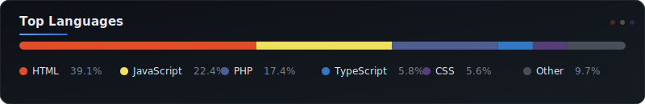

---

<samp>📊 STATS</samp>

<!-- PROFILE_STATS:START -->

  
  
  
  

<!-- PROFILE_STATS:END -->

---

<samp>🛠 TECH STACK</samp>

<samp>Languages</samp>

  
  
  

<samp>CMS / Frameworks</samp>

  
  
  

<samp>Database</samp>

  
  

<samp>Infrastructure</samp>

  
  
  

<samp>DevTools & Automation</samp>

  
  

<samp>Exploring</samp>

  
  
  

---

<samp>💬 LANGUAGES</samp>

---

  🔄 stats auto-updated daily · GitHub Actions

